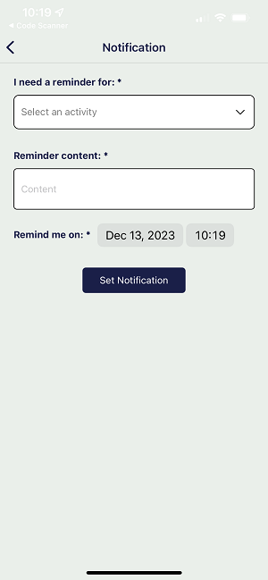

# Pet Diary

<p style="text-align:center">NEU CS5520 Fall 2023<br>
Group 2: Kay (Mengxian) Cai, Iris (Bijin) Zhang</p>

## App Introduction:

Welcome to use Pet Diary! This is a user-friendly mobile app designed for adults who are passionate about their pets and want to keep track of their furry friends' daily lives. Users can log activities including food, treats, water, pee, poop, sleep, play, walks, tooth brushing, grooming, training, medication, vet, vaccination, vomit, nail cut, deworming, and custom. Users can also set notifications for events like food, medication, and vet reminders, enabling them to maintain their pets' well-being. The app also allows users to explore information about pet service providers and veterinarians based on location.

Introduction video: https://www.youtube.com/watch?v=-3Ko4rG3P9U

## Table of Contents

- [Getting Started](#getting-started)
  - [Prerequisites](#prerequisites)
  - [Firebase Configuration](#firebase-configuration)
  - [Create a .env file](#create-a-env-file)
  - [Installation](#installation)
- [Running the App](#running-the-app)
- [Current State](#current-state)
  - [Iteration 3](#iteration-3-dec-12-2023)
  - [Iteration 2](#iteration-2-dec-1-2023)
  - [Iteration 1](#iteration-1-nov-19-2023)
  - [Member Contribution](#member-contribution)
  - [Future Work](#future-work)
- [User Guide (Youtube Video)](#user-guide-youtube-video)
- [Database Structure](#database-structure)

## Getting Started

### Prerequisites

Before you begin, ensure you have the following software installed on your machine:

- Node.js: [Download here](https://nodejs.org/)
- npm (Node Package Manager): Installed with Node.js

### Firebase Configuration

This project uses Firebase Firestore as the backend database. Follow these steps to set up Firebase for your app:

1. Create a Firebase project: [Firebase console](https://console.firebase.google.com/).
2. Navigate to the Cloud Firestore section and create a [Cloud Firestore database](https://firebase.google.com/docs/firestore/quickstart).
3. Obtain your Firebase configuration by navigating to Project Settings > General > Your apps > SDK setup and configuration.

Copy the configuration object.

### Create a .env file

Create a new file named `.env` in the root folder and paste the following, replacing the placeholder values with your Firebase credentials. You will also need a Yelp API key to connect with Yelp API.

```javascript
// PetDiaryApp/.env

apiKey = "YOUR_API_KEY";
authDomain = "YOUR_AUTH_DOMAIN";
projectId = "YOUR_PROJECT_ID";
storageBucket = "YOUR_STORAGE_BUCKET";
messagingSenderId = "YOUR_MESSAGING_SENDER_ID";
appId = "YOUR_APP_ID";
yelpAPIKey = "YOUR_YELP_API_KEY";
```

### Installation

1. Clone the repository.

```bash
git clone https://github.com/kaycaimx/PetDiary.git
```

2. Navigate to the project directory.

```bash
cd PetDiaryApp
```

3. Install dependencies:

```bash
npm install
```

## Running the App

To run the app on an emulator or a physical device, use the following commands:

```bash
npm expo start
```

## Current State

### Iteration 3 (Dec 12, 2023)

- Extend camera use on AddLogScreen
- Add map with markers in the SpotScreen and stylings
- Authentication
- Notification

### Iteration 2 (Dec 1, 2023)

- Camera use
  - User can take a photo or select a photo from album to set as the head icon/avatar for their pets in the app
- External API use
  - User can see nearby pet-related business provide by Yelp with name, rating and hyperlinks to Yelp app page
- Location use
  - The abovementioned functionality uses user's current location
- Other updates:
  - User now can select which pet to add logs, and each pet's screen will only that pet's own logs
- Issues:
  - Currently in the first render of SpotScreen a type error will appear because userLocation is null and cannot read latitude or longtitute of null, we will fix this in the next iteration

### Iteration 1 (Nov 19, 2023)

- Functionalities implemented:

  - User can add a pet
  - User can read logs and filter logs by searching activity type
  - User can add, edit and delete a log

- 3 Navigators implemented:
  - native stack (App.js): among HomeScreen, ProfileScreen, and EditLogScreen
  - bottom tab (HomeScreen.js): among LogScreen, AddLogScreen, and SpotScreen
  - material top tab (LogScreen.js): among PetScreen, and AddPetScreen
- CRUD implemented:
  - Full CRUD of log data to Firestore database
  - Create operations of pet data to Firestore database

### Member contribution

- Kay:
  implemented HomeScreen, LogScreen, AddPetScreen, ProfileScreen, NotificationScree, SpotScreen and related components, AuthContext, PetsContext, Map, as well as navigation among these screens, CRUD of log data, creation of pet data, refactoring of AddLogScreen and EditLogScreen, database connection, camera use, and version control;
- Iris: implemented AddLogScreen, EditLogScreen, SpotScreen, SignupScreen, LoginScreen and related components, as well as CRUD of log data, external API use and location use.

### Future work

Future work will consider the following functionalities:

- user can search logs by certain date or period
- pressing a service provider will navigate user to a specific screen of that provider with more details, and user can save it as favorite
- user can add more photos when they edit the posted logs
- implement analytics to provide users with insights into their pets' activities and health trends

## User Guide (Youtube video)

Please see the video at https://www.youtube.com/watch?v=-3Ko4rG3P9U which guides you to use the app.

The app's home screen displays pets in different tabs that users can swipe to view. All logs are shown in reverse chronological order. User can user the top search bar to searh for logs of a certain type.


By pressing the big plus button in the bottom middle of home screen, user can add a log for their pets.


By pressing a specific log in the home screen, user can edit or delete a log.


By pressing the person icon on the top left of the home screen, user can go to Profile screen.


By pressing the reminder icon on the top right of the home screen, user can set a local notification for future events.



By pressing the place icon on the bottom right of the home screen, user can search nearby pet-related service providers based on their location.


User can also view the search results in an interactive map, the below screenshots show how the map looks like in Android and iOS, respectively.


## Database Structure

The below diagram illustrates the hierarchical data model for this app (the foler icon represents a collection/subcollection, and the document icon represents a document):


- the app use a collection called "PetDiaryApp", within this collection are the user documents;
- each user document has certain fields like email and a "pets" subcollection, within the "pets" subcollection are the pet documents;
- each pet document has certain fields like pet name, birthday, etc. and a "logs" subcollection, within the "logs" subcollections are the log documents;
- each log document has certain fields about the details of such logged activity type as shown by the example above.
