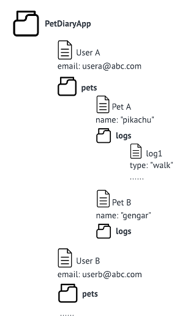

# Pet Diary

<p style="text-align:center">NEU CS5520 Fall 2023<br>
Group 2: Kay (Mengxian) Cai, Iris (Bijin) Zhang</p>

## App Introduction:

Welcome to use Pet Diary! This is a user-friendly mobile app designed for adults who are passionate about their pets and want to keep track of their furry friends' daily lives. Users can log activities including food, treats, water, pee, poop, sleep, play, walks, tooth brushing, grooming, training, medication, vet, vaccination, vomit, nail cut, deworming, and custom. Users can also set notifications for events like food, medication, and vet reminders, enabling them to maintain their pets' well-being. The app also allows users to explore information about pet service providers and veterinarians based on location.

## Table of Contents

- [Getting Started](#getting-started)
  - [Prerequisites](#prerequisites)
  - [Firebase Configuration](#firebase-configuration)
  - [Create a .env file](#create-a-env-file)
  - [Installation](#installation)
- [Running the App](#running-the-app)
- [Current State](#current-state)
  - [Iteration 1](#iteration-1-as-of-nov-19-2023)
  - [Member Contribution](#member-contribution)
  - [Next Iteration](#next-iteration)
- [User Guide](#user-guide)
- [Database Structure](#database-structure)

## Getting Started

### Prerequisites

Before you begin, ensure you have the following software installed on your machine:

- Node.js: [Download here](https://nodejs.org/)
- npm (Node Package Manager): Installed with Node.js

### Firebase Configuration

This project uses Firebase Firestore as the backend database. Follow these steps to set up Firebase for your app:

1. Create a Firebase project: [Firebase console](https://console.firebase.google.com/).
2. Navigate to the Cloud Firestore section and create a [Cloud Firestore database](https://firebase.google.com/docs/firestore/quickstart).
3. Obtain your Firebase configuration by navigating to Project Settings > General > Your apps > SDK setup and configuration.

Copy the configuration object.

### Create a .env file

Create a new file named `.env` in the root folder and paste the following, replacing the placeholder values with your Firebase credentials:

```javascript
// PetDiaryApp/.env

apiKey = "YOUR_API_KEY";
authDomain = "YOUR_AUTH_DOMAIN";
projectId = "YOUR_PROJECT_ID";
storageBucket = "YOUR_STORAGE_BUCKET";
messagingSenderId = "YOUR_MESSAGING_SENDER_ID";
appId = "YOUR_APP_ID";
```

### Installation

1. Clone the repository.

```bash
git clone https://github.com/kaycaimx/PetDiary.git
```

2. Navigate to the project directory.

```bash
cd PetDiaryApp
```

3. Install dependencies:

```bash
npm install
```

## Running the App

To run the app on an emulator or a physical device, use the following commands:

```bash
npm expo start
```

## Current State

### Iteration 1 (as of Nov 19, 2023)

- Functionalities implemented:

  - User can add a pet
  - User can read logs and filter logs by searching activity type
  - User can add, edit and delete a log

- 3 Navigators implemented:
  - native stack (App.js): among HomeScreen, ProfileScreen, and EditLogScreen
  - bottom tab (HomeScreen.js): among LogScreen, AddLogScreen, and SpotScreen
  - material top tab (LogScreen.js): among PetScreen, and AddPetScreen
- CRUD implemented:
  - Full CRUD of log data to Firestore database
  - Create operations of pet data to Firestore database

### Member contribution

- Kay:
  implemented HomeScreen, LogScreen, AddPetScreen, ProfileScreen and related components, as well as navigation among these screens, read of log data, creation of pet data, and version control;
- Iris: implemented AddLogScreen, EditLogScreen and related components, as well as CRUD of log data.

### Next Iteration

The next iteration 2 will focus on:

- External API use
- Camera use
- Location use
- Implement the pet selection in AddLogScreen so that each log will belong to the specific pet and only shown on that pet's PetScreen

## User Guide

When users first enter the app, they will see a welcome screen like below. Press the "Add Pet" icon or swipe to the "Add Pet" tab will navigate users to the AddPetScreen.


Users can add their pets in the AddPetScreen, due to a bug in the react-native-community datetimepicker package, currently users can select the pet's birth date by pressing the calender icon in iOS version, but can only manually enter the birth date in Android version. The screenshots below from left to right are iOS, Android, and alert of invalid format in Android, respectively.


Once a pet is added, users will be navigated to ProfileScreen where they can see a summary of their pets' profile. By pressing the add button below, users can start adding logs for their pets.


In the AddLogScreen, users will select activity type, enter details, add photos and locations (currently in placeholder), and save the log by pressing "Save". Once added, the log will appear in the LogScreen. Users can add more logs by pressing the big add button in the middle of bottom tab.


By pressing a specific log in the LogScreen, users can edit or delete that log.


Users can also add more pets by pressing the "Add Pet" on the top tab or swipe to the "Add Pet" tab.


Users can also filter and search for activities of a certain type by selecting the type in the search bar of the LogScreen.


Pressing the Spot icon in the bottom tab will navigate users to the SpotScreen which connects to external API and will be further implemented in Iteration 2.


## Database Structure

The below diagram illustrates the hierarchical data model for this app (the foler icon represents a collection/subcollection, and the document icon represents a document):



- the app use a collection called "PetDiaryApp", within this collection are the user documents;
- each user document has certain fields like user name and a "pets" subcollection, within the "pets" subcollection are the pet documents;
- each pet document has certain fields like pet name, birthday, etc. and a "logs" subcollection, within the "logs" subcollections are the log documents;
- each log document has certain fields about the details of such logged activity as shown by the example above;
- in the next iteration, we plan to add one more subcollection "favorites" under each user document to store the pet-related businesses saved by a user, within the "favorites" subcollection are the business documents.
